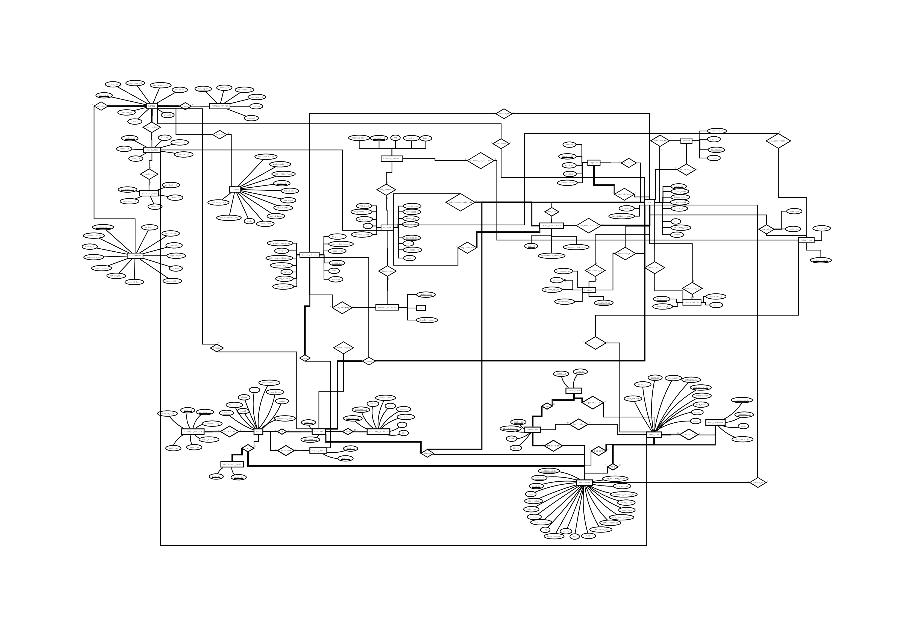
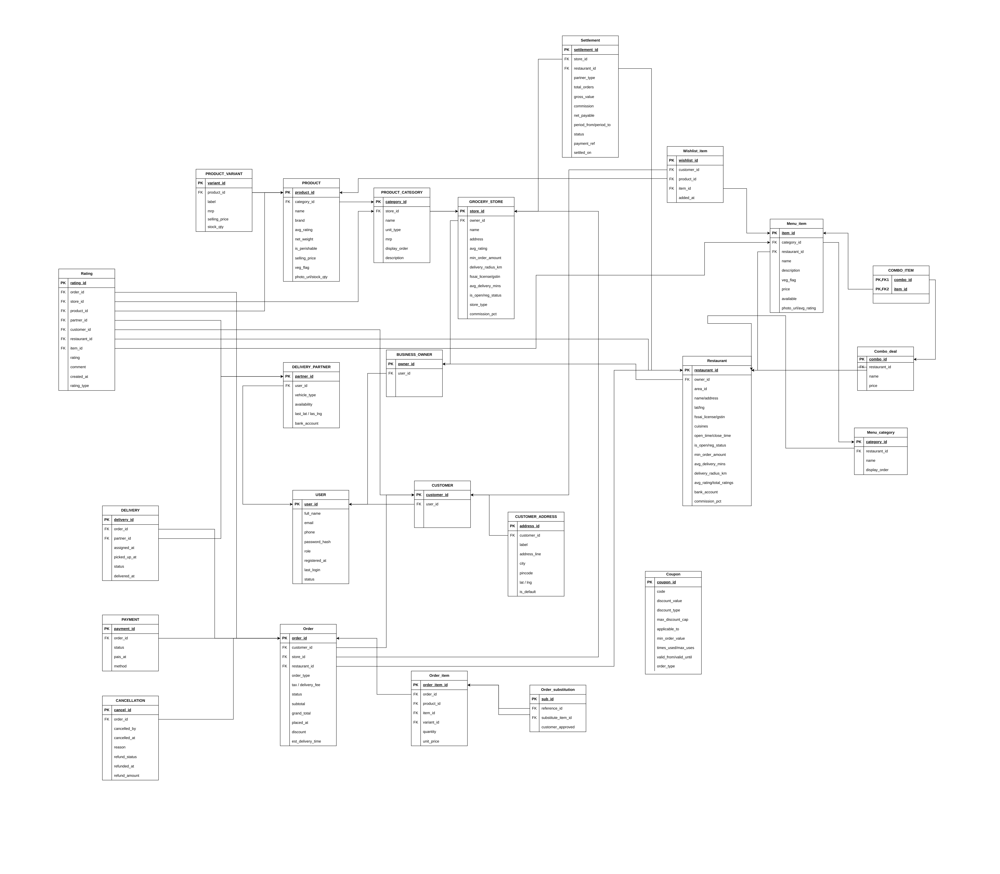

# QuickBite - Food Delivery & Grocery Delivery Database Management System

A comprehensive Database Management System (DBMS) project for an online food and grocery delivery platform, inspired by real-world applications such as Swiggy, Zomato, Blinkit, and Instamart.

QuickBite models the complete workflow of a modern delivery platform, including customer registration, restaurant and grocery store management, product and menu management, order processing, payments, delivery tracking, ratings and reviews, coupons, settlements, and analytical queries.

This project was developed as part of the **IT214 - Database Management System** course.

---

## Table of Contents

* [Project Overview](#project-overview)
* [Key Features](#key-features)
* [System Modules](#system-modules)
* [Database Design](#database-design)
* [Entity Relationship Diagram](#entity-relationship-diagram)
* [Relational Schema](#relational-schema)
* [Database Structure](#database-structure)
* [SQL Files](#sql-files)
* [Sample SQL Queries](#sample-sql-queries)
* [Technologies Used](#technologies-used)
* [Project Structure](#project-structure)
* [Project Statistics](#project-statistics)
* [Learning Outcomes](#learning-outcomes)
* [Future Scope](#future-scope)
* [Contributors](#contributors)
* [License](#license)

---

## Project Overview

QuickBite is a relational database system designed to support an online platform that provides both food delivery and grocery delivery services.

The database supports two major business models:

1. **Food Delivery**
2. **Grocery Delivery**

The system is designed to manage the complete lifecycle of an order, starting from customer registration and browsing through order placement, payment, delivery, and post-delivery activities.

### Order Lifecycle

```text
Customer Registration
        |
        v
Restaurant / Grocery Browsing
        |
        v
Order Placement
        |
        v
Payment Processing
        |
        v
Delivery Assignment
        |
        v
Delivery Tracking
        |
        v
Ratings & Reviews
        |
        v
Settlement
```

The database is designed using relational database principles with appropriate primary keys, foreign keys, constraints, relationships, and normalized tables.

---

## Key Features

### User Management

* Customer registration and user management
* Login management
* Multiple delivery addresses
* Business owner management
* Delivery partner management

### Restaurant Management

* Restaurant registration
* Menu category management
* Menu item management
* Combo deal management
* Restaurant ratings
* Restaurant availability

### Grocery Management

* Grocery store management
* Product category management
* Product management
* Product variant management
* Inventory management
* Grocery store ratings

### Order Management

* Food orders
* Grocery orders
* Order item management
* Order status tracking
* Item substitution
* Order cancellation

### Payment Management

* Online payments
* Cash on delivery
* Payment status tracking
* Refund processing

### Delivery Management

* Delivery partner management
* Delivery assignment
* Pickup tracking
* Delivery tracking
* Delivery ratings

### Rating and Review Management

The system supports ratings and reviews for:

* Restaurants
* Grocery stores
* Products
* Menu items
* Delivery partners

### Additional Features

* Coupon management
* Wishlist management
* Combo offers
* Settlement management
* Reports and analytics

---

## System Modules

The QuickBite database is divided into multiple modules to represent different components of an online delivery platform.

| Module                | Main Tables                                                            |
| --------------------- | ---------------------------------------------------------------------- |
| User Management       | `USER`, `CUSTOMER`, `CUSTOMER_ADDRESS`                                 |
| Business Owners       | `BUSINESS_OWNER`                                                       |
| Restaurant Management | `RESTAURANT`, `MENU_CATEGORY`, `MENU_ITEM`, `COMBO_DEAL`, `COMBO_ITEM` |
| Grocery Management    | `GROCERY_STORE`, `PRODUCT_CATEGORY`, `PRODUCT`, `PRODUCT_VARIANT`      |
| Order Management      | `ORDER`, `ORDER_ITEM`, `ORDER_SUBSTITUTION`                            |
| Delivery Management   | `DELIVERY_PARTNER`, `DELIVERY`                                         |
| Payment Management    | `PAYMENT`                                                              |
| Cancellation          | `CANCELLATION`                                                         |
| Rating and Reviews    | `RATING`                                                               |
| Coupons               | `COUPON`                                                               |
| Wishlist              | `WISHLIST_ITEM`                                                        |
| Settlements           | `SETTLEMENT`                                                           |

---

## Database Design

The project uses a normalized relational database containing more than 24 tables.

The database design focuses on:

* Entity identification
* Relationship modeling
* Primary key constraints
* Foreign key constraints
* Data integrity
* Referential integrity
* Database normalization
* Transaction modeling
* Separation of food and grocery business logic

The database represents real-world relationships between customers, businesses, products, restaurants, orders, payments, delivery partners, and other supporting entities.

---

## Entity Relationship Diagram

The Entity Relationship Diagram represents the entities in the QuickBite system and the relationships between them.

### ER Diagram



The ER diagram provides a visual representation of the database structure, including entities, attributes, primary keys, foreign keys, and relationships.

> **Image location:** `images/ERD.png`

---

## Relational Schema

The relational schema provides a detailed representation of the tables, attributes, primary keys, and relationships used in the database.

### Relational Schema Diagram



> **Image location:** `images/RelationalSchema.png`

The relational schema is derived from the conceptual database design and is implemented using SQL.

---

## Database Structure

The database consists of several interconnected tables representing the major components of the platform.

### User and Customer Management

* `USER`
* `CUSTOMER`
* `CUSTOMER_ADDRESS`
* `BUSINESS_OWNER`

### Restaurant Management

* `RESTAURANT`
* `MENU_CATEGORY`
* `MENU_ITEM`
* `COMBO_DEAL`
* `COMBO_ITEM`

### Grocery Management

* `GROCERY_STORE`
* `PRODUCT_CATEGORY`
* `PRODUCT`
* `PRODUCT_VARIANT`

### Order Management

* `ORDER`
* `ORDER_ITEM`
* `ORDER_SUBSTITUTION`

### Delivery Management

* `DELIVERY_PARTNER`
* `DELIVERY`

### Payment and Cancellation

* `PAYMENT`
* `CANCELLATION`

### Reviews and Additional Services

* `RATING`
* `COUPON`
* `WISHLIST_ITEM`
* `SETTLEMENT`

---

## SQL Files

All SQL scripts required to create, populate, and query the database are available in the `sql/` directory.

```text
sql/
├── schema.sql
├── insert_data.sql
└── queries.sql
```

### 1. schema.sql

This file contains the database definition and table creation statements.

It includes:

* Database and table creation
* Primary keys
* Foreign keys
* Constraints
* Relationships between tables
* Required attributes and data types

### 2. insert_data.sql

This file contains sample data used to populate the database.

The sample dataset includes records for:

* Users
* Customers
* Restaurants
* Grocery stores
* Products
* Menu items
* Orders
* Payments
* Delivery partners
* Ratings
* Other related entities

### 3. queries.sql

This file contains more than 60 SQL queries demonstrating different database operations and SQL concepts.

The queries cover:

* CRUD operations
* Simple SELECT queries
* Filtering
* Sorting
* Joins
* Aggregate functions
* `GROUP BY`
* `HAVING`
* Nested queries
* Correlated subqueries
* Reports
* Analytical queries

---

## Sample SQL Queries

### List All Restaurants

```sql
SELECT *
FROM RESTAURANT;
```

### Top Rated Restaurants

```sql
SELECT restaurant_id,
       name,
       avg_rating
FROM RESTAURANT
ORDER BY avg_rating DESC
LIMIT 5;
```

### Daily Revenue

```sql
SELECT DATE(placed_at),
       SUM(grand_total)
FROM `ORDER`
GROUP BY DATE(placed_at);
```

### Top Customers

```sql
SELECT U.full_name,
       SUM(O.grand_total)
FROM CUSTOMER C
JOIN USER U
    ON C.user_id = U.user_id
JOIN `ORDER` O
    ON C.customer_id = O.customer_id
GROUP BY U.full_name;
```

### Most Ordered Products

```sql
SELECT product_id,
       SUM(quantity)
FROM ORDER_ITEM
GROUP BY product_id;
```

These examples demonstrate how the database can be used to retrieve operational information as well as generate business insights.

---

## Technologies Used

| Technology      | Purpose                                       |
| --------------- | --------------------------------------------- |
| MySQL           | Relational Database Management System         |
| SQL             | Database creation, manipulation, and querying |
| MySQL Workbench | Database development and testing              |
| Draw.io         | ER Diagram and database schema design         |
| Git             | Version control                               |
| GitHub          | Source code and project management            |

---

## Project Structure

```text
QuickBite/
│
├── README.md
│
├── docs/
│   ├── RelationalSchema.pdf
│   └── Project_Report.pdf
│
├── images/
│   ├── ERD.png
│   └── RelationalSchema.png
│
└── sql/
    ├── schema.sql
    ├── insert_data.sql
    └── queries.sql
```

### Directory Description

| Directory/File        | Description                                 |
| --------------------- | ------------------------------------------- |
| `README.md`           | Project documentation                       |
| `docs/`               | Project report and supporting documentation |
| `images/`             | ER diagram and relational schema images     |
| `sql/schema.sql`      | Database and table creation scripts         |
| `sql/insert_data.sql` | Sample database records                     |
| `sql/queries.sql`     | SQL queries and analytical operations       |

---

## How to Run the Project

### Prerequisites

Make sure the following software is installed:

* MySQL
* MySQL Workbench or another MySQL client

### Step 1: Create the Database

Open MySQL Workbench and create a new SQL query window.

Run the commands from:

```text
sql/schema.sql
```

This will create the required database tables and relationships.

### Step 2: Insert Sample Data

After creating the tables, execute:

```text
sql/insert_data.sql
```

This will populate the database with sample records.

### Step 3: Run SQL Queries

Execute:

```text
sql/queries.sql
```

to test the database and generate different results and reports.

### Recommended Execution Order

```text
1. schema.sql
       ↓
2. insert_data.sql
       ↓
3. queries.sql
```

---

## Project Statistics

| Feature           | Count |
| ----------------- | ----: |
| Database Tables   |   24+ |
| SQL Queries       |   60+ |
| Sample Records    |  500+ |
| ER Diagram        |     1 |
| Relational Schema |     1 |
| Business Modules  |   10+ |

---

## Learning Outcomes

This project demonstrates practical implementation of several important database concepts.

### Database Design

* Entity identification
* Entity Relationship modeling
* Relational schema design
* Database normalization
* Primary and foreign key relationships

### SQL

* Data Definition Language
* Data Manipulation Language
* CRUD operations
* Joins
* Aggregate functions
* Grouping and filtering
* Nested queries
* Correlated queries
* Ordering and filtering
* Analytical queries

### Real-World Database Modeling

The project provides practical experience in modeling a real-world delivery platform and understanding how multiple business processes can be represented using a relational database.

---

## Future Scope

The QuickBite database can be extended into a complete software system by adding:

* Web application integration
* REST API development
* Customer dashboard
* Restaurant and grocery partner dashboard
* Admin dashboard
* Real-time order tracking
* Location-based restaurant and store search
* Recommendation system
* Machine learning-based food recommendations
* Mobile application integration
* Real-time inventory synchronization
* Advanced business analytics

---

## Contributors

**Tanvi Nakum**

B.Tech - Information and Communication Technology
Dhirubhai Ambani University (DAU)

---

## License

This project was developed for academic and educational purposes as part of the **IT214 - Database Management System** course.
